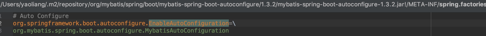

# spring中可以直接使用的小功能代码

阅读，spring, springboot时能发现很多的很好的小功能点，如，加载文件、解析类的方法注解、通过class生成bean等等，本文就来整理下这些小功能

### 加载META-INF/spring.factory


```
List<String> configurations = SpringFactoriesLoader.loadFactoryNames(
		EnableAutoConfiguration.class, getBeanClassLoader());
Assert.notEmpty(configurations, "No auto configuration classes found in META-INF/spring.factories. If you " + "are using a custom packaging, make sure that file is correct.");
return configurations;
```

### 加载classPath:application.yml
```
Properties properties = PropertiesLoaderUtils.loadProperties(new ClassPathResource("application.yml"))
String value = properties.getProperty(String key);
```
### 加载jar:file:/Users/xx/spring-xx.jar!/META-INF/spring.factories
```
加载jar:file:/Users/skyler/.m2/repository/org/springframework/boot/spring-boot/1.5.10.RELEASE/spring-boot-1.5.10.RELEASE.jar!/META-INF/spring.factories
把key=value,value,value转成list<value>

Properties properties = PropertiesLoaderUtils.loadProperties(new UrlResource(url));
String factoryClassNames = properties.getProperty(factoryClassName);
List<String> result = new ArrayList<String>();
result.addAll(Arrays.asList(StringUtils.commaDelimitedListToStringArray(factoryClassNames)));

```

### 通过className生成class bean
SpringFactoriesLoader class
```
private static <T> T instantiateFactory(String instanceClassName, Class<T> factoryClass, ClassLoader classLoader) {
	try {
		Class<?> instanceClass = ClassUtils.forName(instanceClassName, classLoader);
		if (!factoryClass.isAssignableFrom(instanceClass)) {
			throw new IllegalArgumentException(
					"Class [" + instanceClassName + "] is not assignable to [" + factoryClass.getName() + "]");
		}
		Constructor<?> constructor = instanceClass.getDeclaredConstructor();
		ReflectionUtils.makeAccessible(constructor);
		return (T) constructor.newInstance();
	}
	catch (Throwable ex) {
		throw new IllegalArgumentException("Unable to instantiate factory class: " + factoryClass.getName(), ex);
	}
}
```

### 获取一个类中标有指定注解的所有方法
```
final List<Method> methods = new LinkedList<Method>();
ReflectionUtils.doWithMethods(aspectClass, new ReflectionUtils.MethodCallback() {
	@Override
	public void doWith(Method method) throws IllegalArgumentException {
		// Exclude pointcuts
		if (AnnotationUtils.getAnnotation(method, Pointcut.class) == null) {
			methods.add(method);
		}
	}
});
Collections.sort(methods, METHOD_COMPARATOR);
return methods;
```
