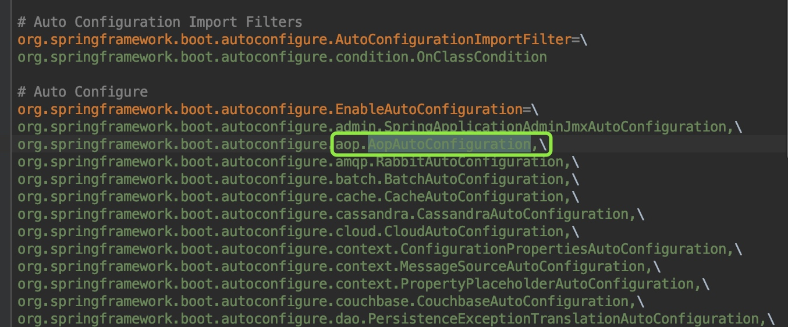

# spring boot @AspectJ解析过程AnnotationAwareAspectJAutoProxyCreator处理过程分析


## 前提
本文主要讲AnnotationAwareAspectJAutoProxyCreator在aop生成代理中的过程和作用，重点是AnnotationAwareAspectJAutoProxyCreator是什么，自身加载到beanFactory容器的时间点，如何在代理中起的作用以及方法具体实现。CglibAopProxy与JdkDynamicAopProxy的介绍后续篇幅

## AutoProxyCreator类层级结构
springboot对AspectJ注解的处理是用过AnnotationAwareAspectJAutoProxyCreator完成的。
首先看下AutoProxyCreator类层级结构


## 项目启动时初始化处理AspectJ注解相关类的分析
springboot之所以能实现自动配置，是因为他的springboot-autoconfigure.jar包有个spring.factores文件，里面记录着很多的XXXAutoConfiguration类

可以找到AopAutoConfiguration类，类实现如下
```
@Configuration
@ConditionalOnClass({ EnableAspectJAutoProxy.class, Aspect.class, Advice.class })
@ConditionalOnProperty(prefix = "spring.aop", name = "auto", havingValue = "true", matchIfMissing = true)
public class AopAutoConfiguration {

	@Configuration
	@EnableAspectJAutoProxy(proxyTargetClass = false)
	@ConditionalOnProperty(prefix = "spring.aop", name = "proxy-target-class", havingValue = "false", matchIfMissing = true)
	public static class JdkDynamicAutoProxyConfiguration {

	}

	@Configuration
	@EnableAspectJAutoProxy(proxyTargetClass = true)
	@ConditionalOnProperty(prefix = "spring.aop", name = "proxy-target-class", havingValue = "true", matchIfMissing = false)
	public static class CglibAutoProxyConfiguration {

	}

}
```
这里可以知道默认情况下使用Jdk动态代理，因为@ConditionalOnProperty的属性决定了使用哪种方式代理.
EnableAspectJAutoProxy是代理相关功能的入口，他的代码如下
```
@Target(ElementType.TYPE)
@Retention(RetentionPolicy.RUNTIME)
@Documented
@Import(AspectJAutoProxyRegistrar.class)
public @interface EnableAspectJAutoProxy {
	boolean proxyTargetClass() default false;
	boolean exposeProxy() default false;
}
```
我们知道，注解的作用是打标识，真正起作用的的是@Import的AspectJAutoProxyRegistrar.class，springboot解析@Configuration类的会解析@Import注解，从而加载AspectJAutoProxyRegistrar类。所以关键地方在AspectJAutoProxyRegistrar，看代码实现
```
/**
 * 根据给定的@EnableAspectJAutoProxy注释，注册一个AnnotationAwareAspectJAutoProxyCreator给当前的BeanDefinitionRegistry 
 */
class AspectJAutoProxyRegistrar implements ImportBeanDefinitionRegistrar {

	/**
	 * 根据@Configuration class import的属性EnableAspectJAutoProxy#proxyTargetClass()的值去注册、配置AspectJ auto proxy creator based on the value
	 * /
	@Override
	public void registerBeanDefinitions(
			AnnotationMetadata importingClassMetadata, BeanDefinitionRegistry registry) {

		AopConfigUtils.registerAspectJAnnotationAutoProxyCreatorIfNecessary(registry); // (1)

		AnnotationAttributes enableAspectJAutoProxy =
				AnnotationConfigUtils.attributesFor(importingClassMetadata, EnableAspectJAutoProxy.class);
		if (enableAspectJAutoProxy.getBoolean("proxyTargetClass")) {
			AopConfigUtils.forceAutoProxyCreatorToUseClassProxying(registry); // (2)
		}
		if (enableAspectJAutoProxy.getBoolean("exposeProxy")) {
			AopConfigUtils.forceAutoProxyCreatorToExposeProxy(registry);// (3)
		}
	}

}
```
(1)处代码是注册一个AnnotationAwareAspectJAutoProxyCreator到BeanFactory容器中。(2)处根据proxyTargetClass的值判断是否使用cglib的代理方式(这就是我们日常工作中要想使用cglib代理方式时声明proxyTargetClass=true的原因)。(3)处代码的作用是否可以通过AopContext.currentProxy()取到代理对象。

到这里有关aop初始化的部分就完了。最终，AnnotationAwareAspectJAutoProxyCreator bean被创建后放入beanFactory。后面当其他类bean instance时会用到它，为什么会用到它呢？<font size=4 color=green>核心关键点：</font><font size=4 color=00hhhh>*因为AnnotationAwareAspectJAutoProxyCreator是一个InstantiationAwareBeanPostProcessor和BeanPostProcessor，所以beanFactory容器中所有的类被创建都会经过他的的实例化前后置处理和初始化前后置处理。而AnnotationAwareAspectJAutoProxyCreator从父类AbstractAutoProxyCreator继承来的postProcessBeforeInstantiation(Class<?> beanClass, String beanName)方法和postProcessAfterInitialization(Object bean, String beanName)方法都是生成代理类的功能。*</font>两个方法生成代理类的时机不同，过滤条件也不一样，下面详细说下

## 代理类创建入口<font size=4>-AnnotationAwareAspectJAutoProxyCreator发挥威力之时</font>
前面我们说过，因为AnnotationAwareAspectJAutoProxyCreator是InstantiationAwareBeanPostProcessor子类，所以每个beanClass(即bean definition)被创建成bean之前都会经过AnnotationAwareAspectJAutoProxyCreator的postProcessBeforeInstantiation()方法对beanClass前置处理和postProcessAfterInitialization()方法对生成的bean做初始化后置处理， 而这个实例化前置方法和初始化后置方法都是继承父类AbstractAutoProxyCreator的。也就是说一个类如果想生成代理类，在创建成bean的过程中有两次机会。
### postProcessBeforeInstantiation实例化前置方法
首先看第一次机会，即实例化前置方法postProcessBeforeInstantiatio()，代码如下
<font size=2>AbstractAutoProxyCreator#postProcessBeforeInstantiation方法</font>
```
public Object postProcessBeforeInstantiation(Class<?> beanClass, String beanName) throws BeansException {
    // 后面数据map存储Key使用。如果beanName长度大于0，返回beanName,否则返回beanClass 
	Object cacheKey = getCacheKey(beanClass, beanName);
    // 判断targetSourcedBeans是否包含当前beanName,如果不包含；
    // 接着判断是否这个beanName已经生成过代理类，如果没有生成过；
    // 接着判断beanClass是否为advice,advisor,PointCut,AopInfrastructureBean子类或者beanClass有Aspect注解，不产生代理类，如果是，不生成代理
    // 防止重复走(1)处逻辑，提供性能
	if (beanName == null || !this.targetSourcedBeans.contains(beanName)) {
		if (this.advisedBeans.containsKey(cacheKey)) {
			return null;
		}
		// 如果beanClass是advice,advisor,PointCut,AopInfrastructureBean子类或者beanClass有Aspect注解，不产生代理类
		if (isInfrastructureClass(beanClass) || shouldSkip(beanClass, beanName)) { (1)
			this.advisedBeans.put(cacheKey, Boolean.FALSE);
			return null;
		}
	}

	// Create proxy here if we have a custom TargetSource
	if (beanName != null) {
		TargetSource targetSource = getCustomTargetSource(beanClass, beanName);
		if (targetSource != null) {
			this.targetSourcedBeans.add(beanName);
			Object[] specificInterceptors = getAdvicesAndAdvisorsForBean(beanClass, beanName, targetSource);
			Object proxy = createProxy(beanClass, beanName, specificInterceptors, targetSource);
			this.proxyTypes.put(cacheKey, proxy.getClass());
			return proxy;
		}
	}

	return null;
}

```
方法通过滤重和条件判断，符合条件的bean会被创建代理。条件判断是重点，只有targetSourcedBeans不包含且advisedBeans不包含且不是切面概念类且切面advisor类名称不等于beanName，且beanName有自己的targetSource,这些条件满足后才生成代理类

### postProcessAfterInitialization初始化后置方法

然后看第二次机会，即初始化后置方法postProcessAfterInitialization()，代码如下
<font size=2>AbstractAutoProxyCreator#postProcessAfterInitialization方法</font>
```
public Object postProcessAfterInitialization(Object bean, String beanName) throws BeansException {
	if (bean != null) {
		Object cacheKey = getCacheKey(bean.getClass(), beanName);
		if (!this.earlyProxyReferences.contains(cacheKey)) {
			return wrapIfNecessary(bean, beanName, cacheKey);
		}
	}
	return bean;
}
	
	protected Object wrapIfNecessary(Object bean, String beanName, Object cacheKey) {
	if (beanName != null && this.targetSourcedBeans.contains(beanName)) {
		return bean;
	}
	if (Boolean.FALSE.equals(this.advisedBeans.get(cacheKey))) {
		return bean;
	}
	if (isInfrastructureClass(bean.getClass()) || shouldSkip(bean.getClass(), beanName)) {
		this.advisedBeans.put(cacheKey, Boolean.FALSE);
		return bean;
	}

	// Create proxy if we have advice.
	Object[] specificInterceptors = getAdvicesAndAdvisorsForBean(bean.getClass(), beanName, null);
	if (specificInterceptors != DO_NOT_PROXY) {
		this.advisedBeans.put(cacheKey, Boolean.TRUE);
		Object proxy = createProxy(
				bean.getClass(), beanName, specificInterceptors, new SingletonTargetSource(bean));
		this.proxyTypes.put(cacheKey, proxy.getClass());
		return proxy;
	}

	this.advisedBeans.put(cacheKey, Boolean.FALSE);
	return bean;
}
```
这个方法生成代理类的方法过滤条件沿用了postProcessBeforeInstantiation方法过滤逻辑，在这个基础上又增加了两个：
earlyProxyReferences不包含这个bean和根据beanName、beanClass获取到的interceptors有值。这些条件满足后生成代理类
