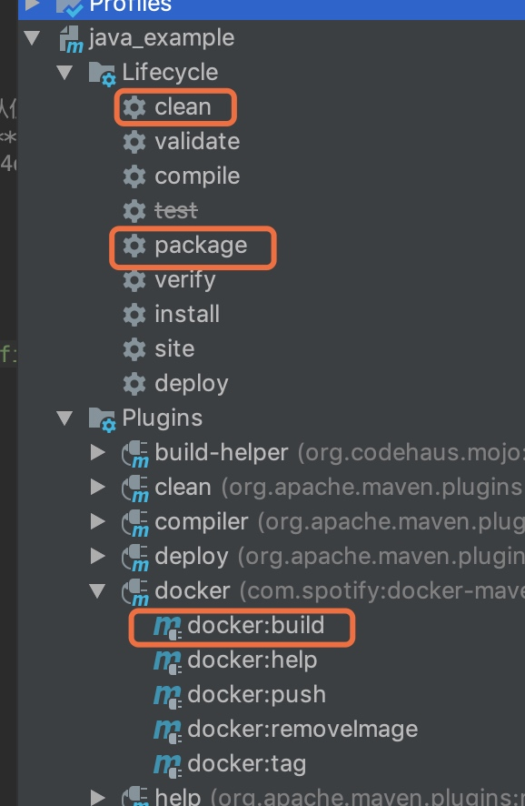
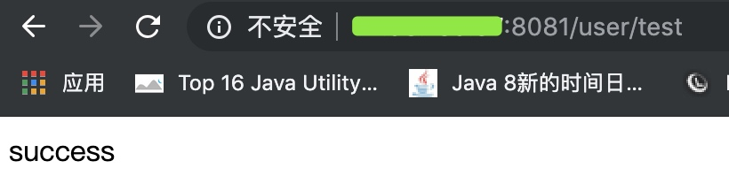

# springboot集成docker
## 版本
- spring boot: 1.5.10
- docker engine: 18.09.4; API:1.39
- maven: 3.3.9

## 实战场景
mac本机上intellij创建一个maven project: java_example，远程有一台linux(48.99.190.38)开发机。机器上会安装docker及其组件。项目代码完成后打包上传到linux机器的docker容器中运行。

## linux安装及配置docker
### 安装
官网给出了很详细的安装过程，参照官网就好；https://docs.docker.com/install/linux/docker-ce/centos/

### 配置-开启 Docker api 远程访问
要想远程连接docker，开启 docker api 远程操作的功能，登录远程docker宿主机器(48.99.190.38)，在 /usr/lib/systemd/system/docker.service，文件中，修改 ExecStart 的参数：
```
ExecStart=/usr/bin/dockerd  -H tcp://0.0.0.0:2375  -H unix:///var/run/docker.sock
```
端口自定义设置即可。

重载所有修改过的配置文件，并且重启 docker
```
systemctl daemon-reload    
systemctl restart docker.service
```
- 需要注意的是，由于没有密码登陆任何权限验证，外网或者生产环境需要上证书使用

### intellij创建project
通过Intellij创建maven project: <font color=green>java_example</font>
pom.xml引入依赖
```
<parent>
    <groupId>org.springframework.boot</groupId>
    <artifactId>spring-boot-starter-parent</artifactId>
    <version>1.5.10.RELEASE</version>
</parent>

<properties>
    <java.version>1.8</java.version>
    <project.build.sourceEncoding>UTF-8</project.build.sourceEncoding>
    <project.reporting.outputEncoding>UTF-8</project.reporting.outputEncoding>
</properties>

<dependencies>
    <dependency>
        <groupId>org.springframework.boot</groupId>
        <artifactId>spring-boot-starter-web</artifactId>
    </dependency>
        <dependency>
        <groupId>org.springframework.boot</groupId>
        <artifactId>spring-boot-starter-test</artifactId>
        <scope>test</scope>
    </dependency>
</dependencies>
```

创建类
```
@SpringBootApplication
public class JavaExampleApp {
    public static void main(String[] args) throws Exception {
        System.out.println("app"+new Date());
        SpringApplication.run(JavaExampleApp.class, args);
    }
}

@RestController
@RequestMapping("/user")
public class UserController {

    @RequestMapping("/test")
    public String test() {
      return "success";
    }
}
```
创建application.yml文件
```
logging:
  level:
    root: info

server:
  port: 20282
```
#### 引入docker maven插件
在pom.xml中加入 docker-maven-plugin, 网上有许多maven docker插件，这里我们选择com.spotify 
```
<properties>
    <docker.image.prefix>springboot_demo</docker.image.prefix>
</properties>
    
<build>
    <plugins>
        <!-- Docker maven plugin -->
        <plugin>
            <groupId>com.spotify</groupId>
            <artifactId>docker-maven-plugin</artifactId>
            <version>1.0.0</version>
            <configuration>
                <!-- 打包的image名称 -->
                <imageName>${docker.image.prefix}/${project.artifactId}</imageName>
                <!-- Dockerfile文件的位置，以项目的 root 目录为根节点，建议到单独建立一个目录。位置非固定，随意指定，如：./src/docker/-->
                <dockerDirectory>src/main/docker</dockerDirectory>
                <!-- 远程docker的api地址，这里为我的linux开发机地址-->
                <dockerHost>http://48.99.190.38:2375</dockerHost>
                <!-- image tag，可以指定多个，不声明默认即latest-->
                <imageTags>
                    <imageTag>latest</imageTag>
                    <imageTag>${project.version}}</imageTag>
                </imageTags>
                <!-- 执行构建docker镜像的时候需要哪些文件，即Dockerfile和项目jar和指定他们的位置-->
                <resources>
                    <resource>
                        <!--这里指定的文件是target中的jar文件 -->
                        <!--
                            ${project.build.directory} 表示项目项目构建输出目录，默认为 ${basedir}/target
                            ${project.build.filename} 表示项目打包输出文件的名称，默认为 ${project.artifactId}-${project.version}
                        -->
                        <targetPath>/</targetPath>
                        <directory>${project.build.directory}</directory>
                        <include>${project.build.finalName}.jar</include>
                    </resource>
                </resources>
            </configuration>
        </plugin>
    </plugins>
</build>
```

#### 创建Dockerfile
引入maven docker时，我们制定了Dockerfile的位置：src/main/docker，所以需要在src/main下创建文件夹docker，cd docker/,再创建文件Dockerfile
```
# 基础镜像：仓库是java，tag是8
FROM java:8

#容器对外暴露8080端口,即可以通过这个端口访问容器内的服务，这个端口与容器内服务的端口存在一个对应关系，也可以在docker run时指定，本文即是这么做的，所以这里注释掉了，见后面docker run命令
#EXPOSE 8080

# 将本地/tmp目录持久化到Docker宿主主机内. 因为Spring Boot使用内嵌Tomcat容器,其默认使用/tmp作为工作目录。
# 所以效果就是将tomcat工作目录/tmp下的文件上传到远程docker主机的/var/lib/docker/**/
# 查在远程docker主机的文件：/var/lib/docker/overlay2/5e3d14ca7fedf5ee2c6ca2744d4da664f09f12affec8ed391740a8b92896f52f/diff/app.jar
VOLUME /tmp

#将打包好的程序拷贝到容器中的指定位置
ADD java_example-0.0.1-SNAPSHOT.jar app.jar

#容器启动后需要执行的命令
ENTRYPOINT ["java","-Djava.security.egd=file:/dev/./urandom","-jar","/app.jar"]
```

#### 使用docker构建项目
两种方式
1. 命令
cd ${project.dir}   #如：cd ~/skyler/project/mytest/java_example 
mvn clean package docker:build -DskipTests

2. 利用intellij maven插件


依次点击clean, package, docker:build

成功的效果为：


构建完可以看下本地生成的文件及目录：


简单来说，构建过程为首先把jar包和Dockerfile生成到构建目录下，然后执行Dockerfile中的指定，即构建image推到远程docker机器的/var/lib/docker/**/下，如下图


### docker运行image
#### 查看image
登录远程docker机器查看刚上传的image
```
docker image ls
```
通过intellij输出log中的f29374d5a2d5可以找到对应的image id: f29374d5a2d5


#### 运行image
```
docker run -p 8081:20282 -t springboot_demo/java_example
```
页面输出启动日志，可以看到和我们通过intellij main启动一样的日志内容

在浏览器中访问项目restful接口：
http://48.99.190.38:8081/user/test，接口返回success信息


也可以通过docker查看运行状态的image
```
docker ps
```


到此基本的通过Dockerfile，springboot集成docker完事了

### docker使用spring profile特性
使用spring boot 我们都知道，可以根据profile指定不同的env环境,从而加载不同环境的配置，实现多环境切换部署。使用docker也可以实现spring profile特性。具体如下
方法之一：
在Dockerfile中指定，具体为ENTRYPOINT在原有基础上增加Dspring.profiles.active=local，如下
```
ENTRYPOINT ["java","-Djava.security.egd=file:/dev/./urandom","-Dspring.profiles.active=local","-jar","/app.jar"]
```
为区分不同环境，java_example新建application-local.yml, 为容易分辨效果，指定一个新端口
```
server:
  port: 20281

debug: false
```


重新构建在intellij上clean, package, docker:build, 去docker宿主机器上运行*docker image ls*，观察CREATED字段的时间确定新的image. 运行新的image前，需要停止刚已启动的image
```
docker ps
# 找到已启动的image的containerId

docker kill containerId

docker run -p 8081:20281 -t springboot_demo/java_example
```
再看日志

端口已经变成20281了，spring profile已经生效了

扩展：docker 使用spring profile特性有几种方式，参考如下：https://segmentfault.com/a/1190000011367595

## docker-compose
- 意义

> 前面我们使用 Docker 的时候，定义 Dockerfile 文件，然后使用 docker build、docker run 等命令操作容器。然而微服务架构的应用系统一般包含若干个微服务，每个微服务一般都会部署多个实例，如果每个微服务都要手动启停，那么效率之低，维护量之大可想而知

> 使用 Docker Compose 可以轻松、高效的管理容器，它是一个用于定义和运行多容器 Docker 的应用程序工具

- 安装

下载稳定版本

```
sudo curl -L "https://github.com/docker/compose/releases/download/1.24.0/docker-compose-$(uname -s)-$(uname -m)" -o /usr/local/bin/docker-compose
```
给目录添加执行权限
```
sudo chmod +x /usr/local/bin/docker-compose
```
可选功能:自动补全
```
 sudo curl -L https://raw.githubusercontent.com/docker/compose/1.24.0/contrib/completion/bash/docker-compose -o /etc/bash_completion.d/docker-compose
```
查看安装是否成功
```
docker-compose -v
# output：docker-compose version 1.20.0, build ca8d3c6
```
- 组装文件
docker-compose执行需要项目jar和Dockerfile
> 回溯下intellij使用maven clean, package, docker:build操作吗，现在只需要maven clean, package操作，然后将target/docker下的Dockerfile和java_example-0.0.1-SNAPSHOT.jar上传到docker宿主机器

```
cd **/target/docker
scp Dockerfile root@48.99.190.38:/root/skyler_home/project #输入密码
scp java_example-0.0.1-SNAPSHOT.jar root@48.99.190.38:/root/skyler_home/project #输入密码
touch docker-compose.yml
vim docker-compose.yml
输入内容:
version: '3.3'

services:
  java_example:
    build: .
    depends_on:
      - mybatis-mysql
    ports:
      - 8081:20282
# 20282需要和java_example项目里配置的server.port一致
```
- 运行docker-compose
在 docker-compose.yml 所在路径下执行该命令 Compose 就会自动构建镜像并使用镜像启动容器

```
docker-compose up
docker-compose up -d  // 后台启动并运行容器
```

docker run -d \
    --name mybatis-mysql2 \
    -e MYSQL_ROOT_PASSWORD=root123 \
    -e MYSQL_DATABASE=jdbc_test \
    -e MYSQL_USER=root \
    -e MYSQL_PASSWORD=root123 \
    mysql:latest

docker run -d -t \
    --name demo-springboot-docker \
    --link mybatis-mysql2:mysql \
    -p 2372:2371 \
    -e DATABASE_HOST=mybatis-mysql2 \
    -e DATABASE_PORT=3306 \
    -e DATABASE_NAME=jdbc_test \
    -e DATABASE_USER=root \
    -e DATABASE_PASSWORD=root123 \
    springboot_demo/springboot_mybatis


